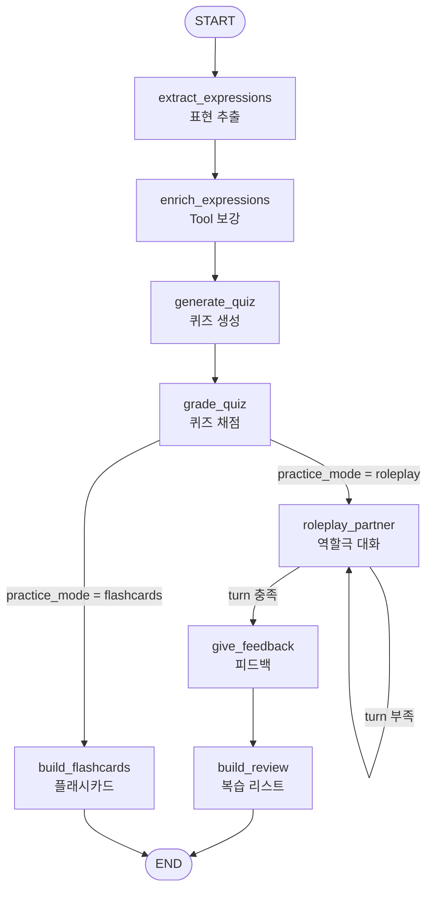

# LinguaLoop 🎓 (말문)

> **영상으로 배운 표현을 실제로 "써보게" 만드는 AI 언어 학습 파트너**
> Input → Analysis → Role Play → Feedback → Review 흐름을 LangGraph로 구현한 교육용 에이전트입니다.

---

## 📌 소개

외국어 영상을 보며 표현을 정리해도, 실제로 써볼 기회가 없어 금방 잊어버립니다.
**LinguaLoop**은 학습을 *입력 중심*에서 *출력 중심*으로 바꿉니다.

- **입력** — 사용자가 모국어·학습 언어·자막(유튜브 등)을 제공
- **처리** — 자막에서 회화용 핵심 표현을 뽑고, 사전·웹 검색으로 보강한 뒤, 퀴즈로 각인
- **출력** — AI 파트너와의 실전 대화에서 그 표현을 **쓰도록 유도**하고, 사용 여부를 채점해 피드백 + 복습 리스트로 연결

## 🎯 해결하는 문제

| 기존 학습 | LinguaLoop |
|---|---|
| 표현을 눈으로만 보고 넘어감 (입력) | 대화에서 직접 사용하도록 유도 (출력) |
| 회화 상대를 구하기 어려움 | 상황별 AI 파트너가 즉시 대화 |
| 무엇을 다시 봐야 할지 모름 | 미사용·오답 표현을 복습 리스트로 자동 정리 |
| 학습 이력이 흩어짐 | SQLite에 학습 이력을 영속 저장 |

## ✨ 핵심 기능

1. **표현 추출 (Analysis)** — 자막에서 회화용 핵심 표현 5~10개를 뜻·예문과 함께 추출
2. **🔧 Tool 보강 (Enrich)** — 커스텀 사전 도구 + **웹 검색(DuckDuckGo)** 으로 정의·유의어·실제 예문 보강
3. **퀴즈 & 채점 (Quiz)** — 추출 표현으로 빈칸 퀴즈를 만들고 사용자의 답을 채점
4. **연습 모드 분기 (Conditional Edge)** — 사용자의 선택(`practice_mode`)에 따라 **역할극 ↔ 플래시카드** 로 분기
5. **역할극 대화 파트너 (Role Play)** — 상황별 페르소나(바리스타 등)로 대화하며 학습 표현 사용을 유도
6. **피드백 & 복습 (Feedback / Review)** — 표현 사용 여부를 채점하고, 미사용·오류 표현을 간격 반복 스케줄(1·3·7일)로 정리
7. **💾 영속 메모리 (Memory)** — `SqliteSaver`로 `thread_id`별 학습 이력을 SQLite 파일에 저장 (세션이 끊겨도 유지)

## 🗺️ 아키텍처 (LangGraph 그래프)



- **Conditional Edge #1** `route_by_mode` — 사용자 입력에 따라 역할극/플래시카드로 분기
- **Conditional Edge #2** `route_after_roleplay` — 대화 턴이 `max_turns`에 도달할 때까지 역할극 자기 순환

## 🧱 State 구조 (`TypedDict`)

| 필드 | 설명 |
|---|---|
| `native_language`, `target_language` | 모국어 / 학습 언어 |
| `transcript` | 입력 자막 |
| `key_expressions` | 추출된 핵심 표현 |
| `enriched_expressions` | 🔧 Tool로 보강된 표현(정의·유의어·예문) |
| `quiz`, `quiz_answers`, `quiz_score` | 퀴즈·사용자 답·점수 |
| `practice_mode` | 사용자 선택 (분기 기준) |
| `messages` | 역할극 대화 기록 (`add_messages` 리듀서로 누적) |
| `turn_count`, `max_turns` | 대화 턴 / 종료 조건 |
| `feedback`, `review_list`, `flashcards` | 산출물 |
| `study_history` | 💾 학습 이력 (`operator.add` 리듀서로 누적, SQLite 영속) |

## 🛠️ 기술 스택

- **오케스트레이션**: LangGraph, LangChain
- **LLM**: OpenAI GPT (`gpt-4o-mini`)
- **Tool**: 커스텀 사전 도구, DuckDuckGo 웹 검색(`langchain-community`)
- **메모리**: `SqliteSaver` (SQLite)
- **(로드맵) 입력 파이프라인**: YouTube Data API, Whisper

## ⚙️ 설치

```bash
pip install -U langgraph langchain-core langchain-openai \
    langgraph-checkpoint-sqlite langchain-community duckduckgo-search
```
